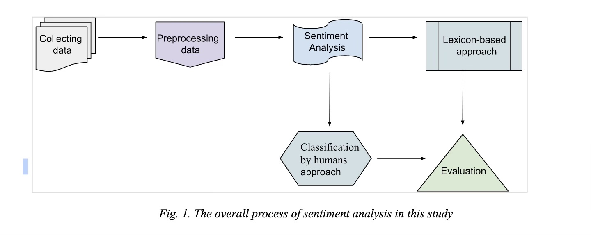

# Online Reviews Sentiment Analysis & Classification pipeline

This project contains a number of tools used to build data analysed as part of
my MSc in Human Computer Interaction Design at City, University of London.

The project is split across multiple scripts that represent a stage in the
pipeline.


# Design

Project is organised into two folders:

```
sentiment: scripts used for sentiment analysis and classification
utils: scripts used to manipulate data
```



Data used is scraped from trustpilot's website. The focus of the project is to
analyse netflix reviews.

1. **Data collection:** handled through `utils/scrape.py`. The script accepts a
search key that it uses to filer the reviews collected. The scraper does not use
an official API so pagination is handled through different URLs (e.g. scrape
page 1, page 2, and so on). Before using, consult the webpage yourself to see
how many pages exist.

2. **Preprocessing:** before analysing, data is cleaned-up. Many reviews contain
lots of sentences. This makes it harder to infer the sentiment and achieve an
accurate score. `sentiment/preprocess.py` will accept a CSV file with reviews
(generated in step 1) and clean up the data using a combination of models (spacy
and nltk). Punctuation is stripped and sentences broken down.

3. **Sentiment analysis**: `sentiment/sentiwordnet.py` contains the main script
used to rate words. The script scores each word in a sentence, builds an
aggregate and saves the output with the original text.

4. **Topic modelling**: `sentiment/modeltopics.py` generates a topic table (as a
reference point) and an output file with the original text and assigned topic.
Assigned topic is an entry that corresponds to an entry in the topic table. The
two have to be correlated.

As seen in the picture, steps (3) and (4) do not have a dependency when it comes
to ordering and can be run in parallel. They are both substeps in "Lexicon based
approach" analysis seen in the diagram. In writing the thesis, some of the data
went through some manual iterations (e.g. cleaning it up where nltk did not do a
good job based on its training data). These scripts serve as a starting point
and guide to cleaning and collecting data. For this reason, utils contains two
more scripts `splitdata.py` and `gen-wordcloud.py` that were used to manipulate
data quoted in paper.

## Project set-up

* `git clone`` this project
* Requires: `python-3.11.5` (or higher) and a virtual env.
* To install dependencies (e.g. spacy): `pip install -r requirements.txt`
* Recommendation: create a local `results/` folder to save output.

Full list of dependencies can be found in [requirements.txt](requirements.txt)

**Note**: some scripts require nltk models, these are downloaded automatically by the script
in a folder local to the project (called `nltk`).

## Running

Each script can be run stand-alone as long as dependencies are met. Each script
has a command line interface to make running easier.

### Scraping:

```sh
$ mkdir results/
$ usage: python scrape.py [-h] [SEARCH_KEY] [--start] [--end]

Script that will scrape reviews for 'www.netflix.com' from trustpilot's platform.The script should be run with a page range (start and end) and a keyword to filter reviews on. To run the scrape, the script makes use of an undocumented script tag in trustpilot's HTML page that lists review data
in JSON format. Outputs a CSV file with all of the scrape reviews.

positional arguments:
  search_key     Term used to filter the review search. It is also used in the name of the saved file

options:
  -h, --help     show this help message and exit
  --start START  Page in the list of reviews to start the scrape from (default: 1)
  --end END      Page in the list of reviews to stop the scrape at (default: 1)
```

Example: `python utils/scrape.py interface --end 5`

Will scrape reviews from trustpilot's netflix page and consider only reviews that mention "interface". 5 pages are scraped. Results saved to `results/interface_scrape_result.csv`

### Preprocessing:

```sh
usage: python preprocess.py [-h] [INPUT_FILE] [--output <filename>]

Preprocess data using nltk and spacy's NLP model. Text from reviews will be stripped of punctuation and lemmatized using spacy.

positional arguments:
  input_file            Path to the file to process (relative to script)

options:
  -h, --help            show this help message and exit
  --output-file OUTPUT_FILE, -o OUTPUT_FILE
                        Path to output processed text

WARNING: script will download nltk data. First run might take longer than expected. nltk data wil be downloaded in current working folder.
```

Example: `python sentiment/preprocess.py results/interface_scrape_result.csv -o results/processed_text.csv`

**Note**: this will download nltk data.

### Sentiment word analysis:

```sh
usage: python sentiwordnet.py [-h] [INPUT_FILE] [--output <filename>]

Run sentiwordnet on processed data. Sentiwordnet will classify processed text and identify the sentence by aggregating score from each word into a sum that assigns the sentiment to the sentence.

positional arguments:
  input_file            Path to the file to process (relative to script)

options:
  -h, --help            show this help message and exit
  --output-file OUTPUT_FILE, -o OUTPUT_FILE
                        Path to output processed text

WARNING: script will download nltk data. First run might take longer than expected. nltk data wil be downloaded in current working folder.
```

Example: `python sentiment/sentiwordnet.py results/processed_text.csv -o results/sentiwordnet.csv`

Will create a `sentiwordnet.csv` file.

### Topic modelling:

```sh
usage: python modeltopics.py [-h] [INPUT_FILE] [--output <filename>] [--reference-file <filename>] [-n]

Run topic modelling on a series of sentences that have been extracted from reviews. It will generate two files: one for topics that preserves initial text, and a table with the assignment.

positional arguments:
  input_file            Path to the file to process (relative to script)

options:
  -h, --help            show this help message and exit
  --output-file OUTPUT_FILE, -o OUTPUT_FILE
                        Path to output processed text
  --reference-file REFERENCE_FILE
                        Path to output reference table for assignment
  --topic-num TOPIC_NUM, -n TOPIC_NUM
                        Number of topics (default: 10)

WARNING: script will download nltk data. First run might take longer than expected. nltk data wil be downloaded in current working folder.
```

Example: `python sentiment/modeltopics.py results/processed_text.csv -o results/topicmodelling.csv --reference-file results/topicreference.csv`

This will create two files: one with the topic assigned to a text and one with the reference table.


## References:

Websites that helped inspire some of the code and project layout:

1. https://www.nltk.org/index.html
2. https://docs.python-guide.org/writing/documentation/
3. https://docs.python.org/3/library/argparse.html#module-argparse
4. https://docs.python-guide.org/writing/structure/#modules
